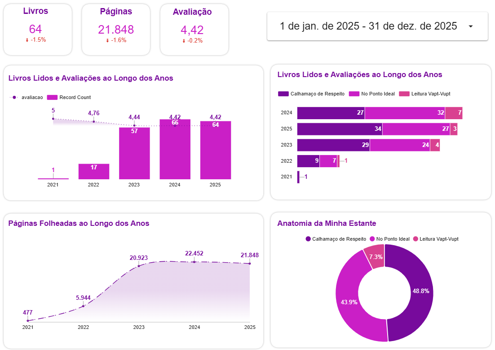
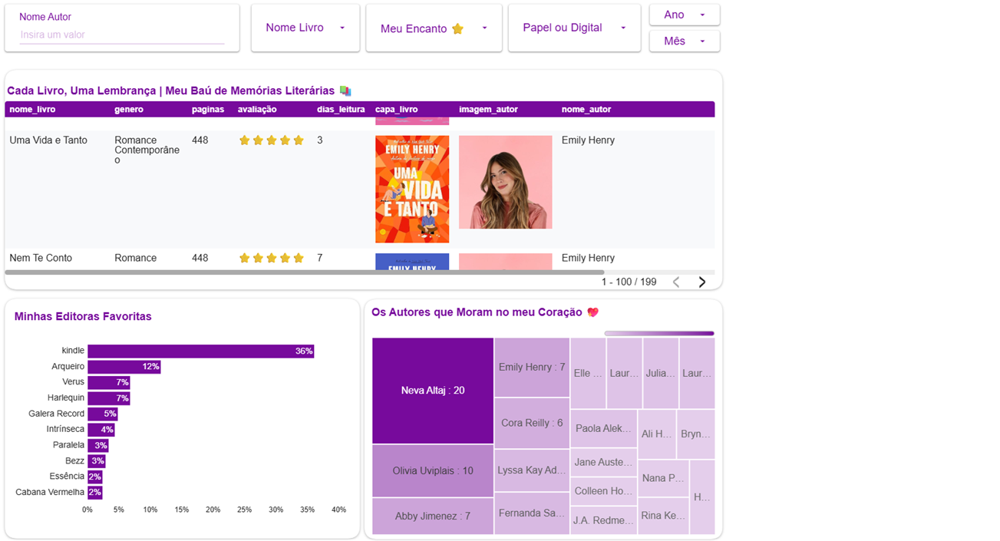
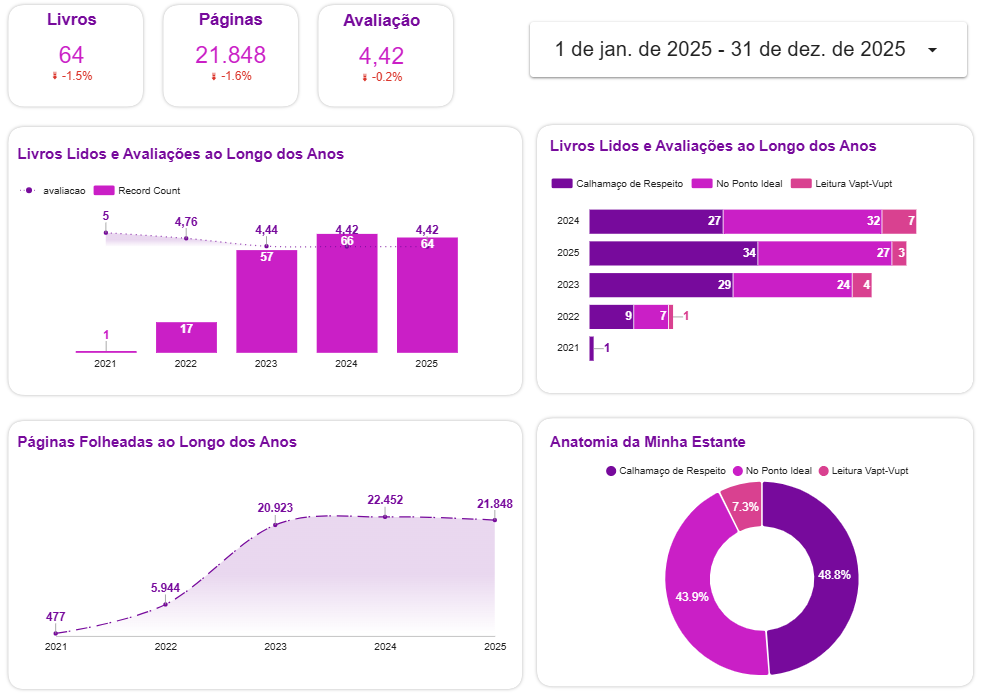

# Além da Capa: Pipeline Analítico de Hábitos Literários 📚


## 📌 Visão Geral
Este projeto simula uma arquitetura de dados corporativa end-to-end aplicada a um dataset pessoal de leituras. O objetivo foi transformar dados brutos (CSV) em insights estratégicos, utilizando as melhores práticas de **Engenharia de Dados** e **MIS**.

### 📝 Do Analógico ao Digital: O Desafio de MIS

O ponto de partida deste projeto foi uma agenda física, onde os registros de leitura eram documentados manualmente. Embora os dados existissem, eles sofriam com a **descentralização** e a **dificuldade de análise**. 

Não era possível identificar tendências de gênero, picos de produtividade mensal ou a evolução das avaliações sem um esforço manual de consolidação.


A pipeline construída **automaticamente** ingere, limpa e orquestra esses dados no BigQuery, disponibilizando-os de forma granular no Looker Studio. Isso transformou um diário pessoal em um **Framework Analítico de Alta Fidelidade**, permitindo uma visão executiva e estratégica da jornada literária.

---
## 🏗️ Arquitetura Técnica (GCP Stack)

A solução foi construída sobre a **Google Cloud Platform**, garantindo escalabilidade e baixa manutenção:

1.  **Ingestão (Data Lake):** Armazenamento de arquivos brutos no **Google Cloud Storage**.
2.  **Processamento (Data Warehouse):** Modelagem em camadas (`raw`, `refined`, `analytics`) dentro do **BigQuery**.
3.  **Governança & Automação:** * Uso de **External Tables** com tratamento de encoding (ISO-8859-1).
    * Implementação de **Stored Procedures** e **Views** para encapsulamento de lógica de negócio.
    * **Orquestração:** Procedure mestre (`sp_orquestrador`) para execução sequencial do pipeline.
4.  **Visualização (BI):** Dashboard executivo no **Data Studio**.

## 💰 Estimativa de Custos e FinOps

A arquitetura foi projetada seguindo os princípios de eficiência de custo, operando integralmente dentro do **GCP Free Tier** para este volume de dados:

- **BigQuery:** Processamento otimizado via filtragem de partições e seleção estrita de colunas. Custo estimado: $0,00 (Consumo < 1TB/mês).
- **Cloud Storage:** Armazenamento em classe Standard na região `us-central1`. Custo estimado: < $0,01/mês.
- **Monitoramento:** Configuração de orçamentos e alertas (Cloud Billing) para garantir a governança financeira do projeto.

---

### Inteligência de BI
- **UX Dinâmica:** Injeção de metadados visuais (capas de livros e fotos de autores) via URL diretamente no dashboard.

## 📊 Visualização do Dashboard


### Página 1: Visão Executiva (KPIs Globais)

*Distribuição mensal de volume que permite a identificação de picos de produtividade e padrões cíclicos de leitura ao longo do ano.*

### Página 2: Detalhes e Curadoria

*Implementação de tabela interativa que integra URLs dinâmicas para exibição de capas e autores, unindo rigor técnico de dados com uma interface visual rica.*

### Página 3: Comparativo interativo

*Implementação de lógica comparativa que revela a saúde do hábito literário, permitindo uma leitura rápida de crescimento ou queda de produtividade.*

---
```text
📂 src/                        # Código fonte puro
│   📂 sql/
│   │   📂 raw/                # Definições de External Tables
│   │   📂 refined/            # Definições da Refined Tables
│   │   📂 analytics/          # View final e KPIs para o Looker
│   📂 routines/               # Stored Procedures Orquestradoras
│       ├── sp_orchestrator.sql
📂 assets/                     # Identidade visual e evidências
│   📂 images/                 # Prints do Dashboard (Página 1, 2 e 3)
└── README.md                   # Cartão de visitas do projeto